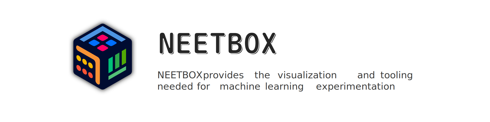

[](https://wakatime.com/badge/user/b93a26b6-8ea1-44ef-99ed-bcb6e2c732f1/project/8f99904d-dbb1-49e4-814d-8d18bf1e6d1c) [](https://github.com/visualDust/neetbox/actions/workflows/poetry-pytest.yml)  
 [](https://github.com/psf/black) [](https://codecov.io/gh/visualDust/neetbox)

## Install

```bash
pip install neetbox
```

Docs: [neetbox.550w.host](https://neetbox.550w.host/)

## Dev

To install editable version or build from source, use the following command:

```bash
# create a virtual environment
conda create -n neetbox python=3.12
conda activate neetbox

# clone the repository
git clone https://github.com/visualDust/neetbox.git
cd neetbox

# install project
poetry install

# build frontend
cd frontend
yarn install
yarn build
```

## Screenshots

|||
|---|---|
| ||


## Contributors

<a href = "https://github.com/visualDust/neetbox/graphs/contributors">
  
</a>

## Acknowledgements

This project usues [Asthestarsfalll/PyDocuSaurus](https://github.com/Asthestarsfalll/PyDocuSaurus) to generate the API reference.

## Star History

[](https://star-history.com/#visualDust/neetbox&Date)
