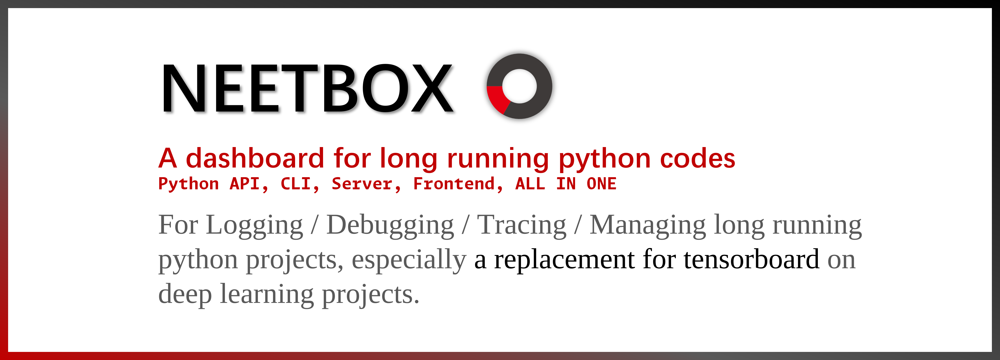
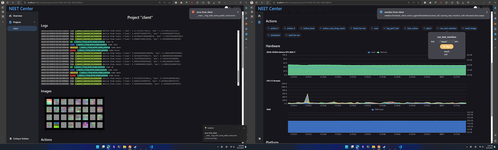

# NEETBOX



Python API, backend server, frontend, ALL IN ONE. A tool box for Logging/Debugging/Tracing/Managing/Facilitating long running python projects, especially a replacement of tensorboard for deep learning projects.

[](https://wakatime.com/badge/user/b93a26b6-8ea1-44ef-99ed-bcb6e2c732f1/project/8f99904d-dbb1-49e4-814d-8d18bf1e6d1c) [](https://github.com/visualDust/neetbox/actions/workflows/poetry-pytest.yml)  
  [](https://github.com/psf/black) [](https://codecov.io/gh/visualDust/neetbox)

## screenshot



## dev

NEETBOX is under heavy development.

- [x] monit multi project on one dashboard
- [x] local/remote logging
- [x] command line cli tools
- [x] system monitoring
- [x] post images to frontend
- [ ] plotting(scatters, line chart...)
- [x] run python code by clicking on frontend buttons
- [x] history automatically saved by backend
- [ ] attach remote logging in command line cli
- [ ] distinguish different runs

## docs

[neetbox.550w.host](https://neetbox.550w.host). (APIs are ready but we are not ready for the doc yet)

## quick start

install neetbox:
```bash
pip install neetbox
```

in any python code folder:
```
neet init
```
neetbox cli generates a config file for your project named `neetbox.toml`

then in your code:
```python
import neetbox
```

run your code and visit https://localhost:20202 to see your dashboard.

## usage examples

[how to guides](todo) provides easy examples of basic neetbox funcionalities.

## Contributors

<a href = "https://github.com/visualDust/neetbox/graphs/contributors">
  
</a>

## Star History

[](https://star-history.com/#visualDust/neetbox&Date)


