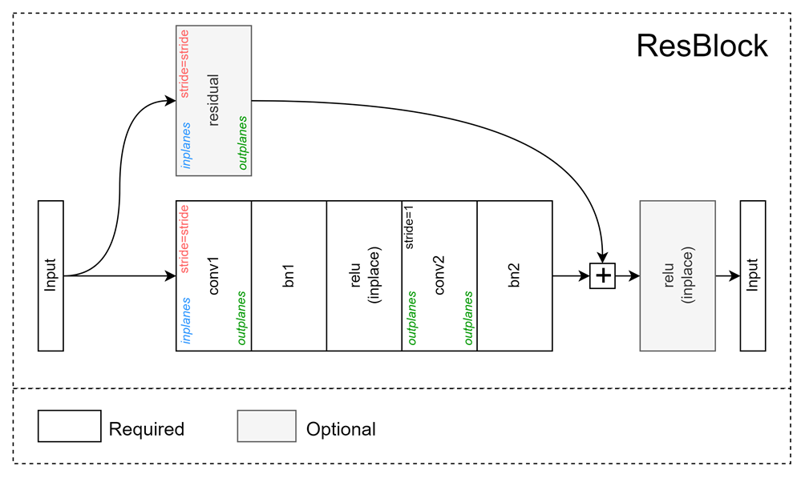

# ResBlock

## Get started

Import dependencies:
```python
from neetbox.torch.arch import cnn
```
Build a ResBlock:
```python
res_block = cnn.ResBlock(
    inplanes=64, outplanes=128, kernel_size=3, stride=2, residual=True, dilation=2
)
res_block.eval()
```
output:
```
ResBlock(
  (conv1): Conv2d(64, 128, kernel_size=(3, 3), stride=(2, 2), padding=(2, 2), dilation=(2, 2))
  (bn1): BatchNorm2d(128, eps=1e-05, momentum=0.1, affine=True, track_running_stats=True)
  (relu_inplace): ReLU(inplace=True)
  (conv2): Conv2d(128, 128, kernel_size=(3, 3), stride=(1, 1), padding=(2, 2), dilation=(2, 2))
  (bn2): BatchNorm2d(128, eps=1e-05, momentum=0.1, affine=True, track_running_stats=True)
  (residual): Sequential(
    (0): Conv2d(64, 128, kernel_size=(1, 1), stride=(2, 2), dilation=(2, 2))
    (1): BatchNorm2d(128, eps=1e-05, momentum=0.1, affine=True, track_running_stats=True)
  )
)
```

## Structure



A sample `ResBlock` consists of:

- `conv1` represents a down sampling(if stride is not 1) `Conv2d` layer. It will be a depth-wise convolution if `depthwise` was set to true, or it will be a dilation convolution if `dilation` is not set to 1.
- `conv2` represents a `Conv2d` layer with stride 1. It will be a depth-wise convolution if `depthwise` was set to true, or it will be a dilation convolution if `dilation` is not set to 1.
- if `residual` was set to true, then `residual` represents a  `Conv2d` layer followed by a `BatchNorm2d` if `pool_on_residual_downsample` is set to false. Other wise it represents a `MaxPool2d` layer if  `pool_on_residual_downsample` is set to `'maxpool'` or a `AvgPool2d` layer if `pool_on_residual_downsample` is set to `'averagepool'`.
- if `skip_last_relu` was set to false, then there is a `ReLu` in the end.

## params for building a `ResBlock`

| Name | Type | Description |
|------|------|-------------|
|inplanes | int | num of channel input |
|outplanes | int | num of channel output |
| kernel_size | int (optional) | kernel size. Defaults to 3. |
| stride | int (optional) | stride for downsampling layer. Defaults to 1. |
| padding | bool (optional) | decide if use padding. If true, then the padding size will be calculated automatically. Defaults to True. |
| residual | bool (optional) | wether use residual. Defaults to False. |
| spatial_separable | bool (optional) | set spatial separable for non-downsamping layers. Defaults to False. |
| dilation | int (optional) | dilation rate. Defaults to 1 means do not use dilation convolution. |
| depthwise | bool (optional) | wether to use depthwise convolution. Defaults to False. |
| pool_on_residual_downsample | bool (optional) | 'maxpool' or 'averagepool' if you want to use pooliinstead of conv2d on residual path. Defaults to False. |
| bn_momentum | float (optional) | momentum of batch norms. Defaults to 0.1. |
| skip_last_relu | bool (optional) | wether to skip the last relu. Defaults to False. |

## Examples

import Tabs from '@theme/Tabs';
import TabItem from '@theme/TabItem';


A 3x3 `ResBlock` with residual, no down-sample

<Tabs>
<TabItem value="code">

```python
model = cnn.ResBlock(inplanes=64, outplanes=128, kernel_size=3, stride=1, residual=True)
```

</TabItem>
<TabItem value="model structure">

```
ResBlock(
  (conv1): Conv2d(64, 128, kernel_size=(3, 3), stride=(1, 1), padding=(1, 1))
  (bn1): BatchNorm2d(128, eps=1e-05, momentum=0.1, affine=True, track_running_stats=True)
  (relu_inplace): ReLU(inplace=True)
  (conv2): Conv2d(128, 128, kernel_size=(3, 3), stride=(1, 1), padding=(1, 1))
  (bn2): BatchNorm2d(128, eps=1e-05, momentum=0.1, affine=True, track_running_stats=True)
  (residual): Sequential(
    (0): Conv2d(64, 128, kernel_size=(1, 1), stride=(1, 1))
    (1): BatchNorm2d(128, eps=1e-05, momentum=0.1, affine=True, track_running_stats=True)
  )
)
```

</TabItem>
</Tabs>

A 5x5 `ResBlock` using dilation convolution(dilation rate = 2) without residual, 2 times down-sample

<Tabs>
<TabItem value="code">

```python
model = cnn.ResBlock(
    inplanes=64, outplanes=128, kernel_size=5, stride=2, residual=False, dilation=2
)
```

</TabItem>
<TabItem value="model structure">

```
ResBlock(
  (conv1): Conv2d(64, 128, kernel_size=(5, 5), stride=(2, 2), padding=(4, 4), dilation=(2, 2))
  (bn1): BatchNorm2d(128, eps=1e-05, momentum=0.1, affine=True, track_running_stats=True)
  (relu_inplace): ReLU(inplace=True)
  (conv2): Conv2d(128, 128, kernel_size=(5, 5), stride=(1, 1), padding=(4, 4), dilation=(2, 2))
  (bn2): BatchNorm2d(128, eps=1e-05, momentum=0.1, affine=True, track_running_stats=True)
)
```

</TabItem>
</Tabs>

A 7x7 `ResBlock` using spatial-separable convolution without residual, 2 times down-sample

<Tabs>
<TabItem value="code">

```python
model = cnn.ResBlock(
    inplanes=64,
    outplanes=128,
    kernel_size=7,
    stride=2,
    spatial_separable=True,
    residual=True,
)
```

</TabItem>
<TabItem value="model structure">

```
ResBlock(
  (conv1): Conv2d(64, 128, kernel_size=(7, 7), stride=(2, 2), padding=(3, 3))
  (bn1): BatchNorm2d(128, eps=1e-05, momentum=0.1, affine=True, track_running_stats=True)
  (relu_inplace): ReLU(inplace=True)
  (conv2): Sequential(
    (0): Conv2d(128, 128, kernel_size=(7, 1), stride=(1, 1), padding=(3, 0))
    (1): Conv2d(128, 128, kernel_size=(1, 7), stride=(1, 1), padding=(0, 3))
  )
  (bn2): BatchNorm2d(128, eps=1e-05, momentum=0.1, affine=True, track_running_stats=True)
  (residual): Sequential(
    (0): Conv2d(64, 128, kernel_size=(1, 1), stride=(2, 2))
    (1): BatchNorm2d(128, eps=1e-05, momentum=0.1, affine=True, track_running_stats=True)
  )
)
```

</TabItem>
</Tabs>

A 3x3 `ResBlock` with a max-pooling-residual, 2 times down-sample

<Tabs>
<TabItem value="code">

```python
model = cnn.ResBlock(
    inplanes=64,
    outplanes=64,
    stride=2,
    kernel_size=3,
    pool_on_residual_downsample="maxpool",
    residual=True,
)
```

:::caution
If you want a pooling operation as a residual path, you need to have your `outplanes` equal to `inplanes`.
:::

</TabItem>
<TabItem value="model structure">

```
ResBlock(
  (conv1): Conv2d(64, 64, kernel_size=(3, 3), stride=(2, 2), padding=(1, 1))
  (bn1): BatchNorm2d(64, eps=1e-05, momentum=0.1, affine=True, track_running_stats=True)
  (relu_inplace): ReLU(inplace=True)
  (conv2): Conv2d(64, 64, kernel_size=(3, 3), stride=(1, 1), padding=(1, 1))
  (bn2): BatchNorm2d(64, eps=1e-05, momentum=0.1, affine=True, track_running_stats=True)
  (residual): MaxPool2d(kernel_size=3, stride=2, padding=1, dilation=1, ceil_mode=False)
)
```

</TabItem>
</Tabs>
