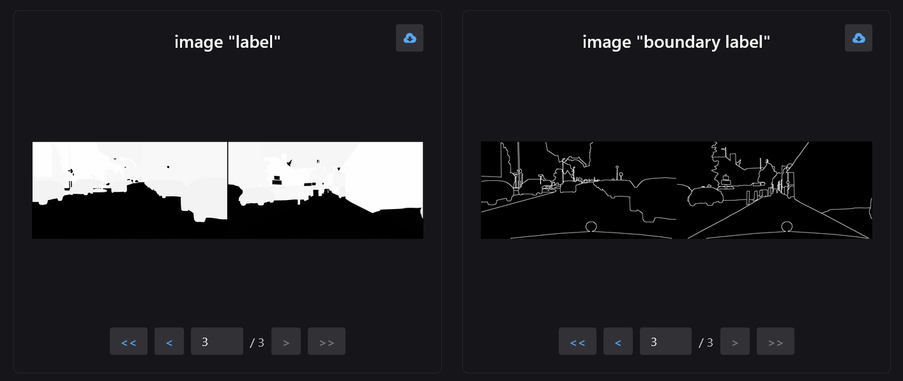
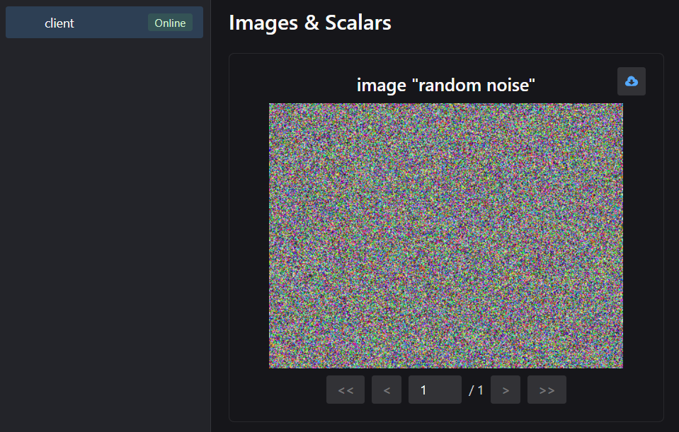

:::tip
`neetbox.add_image` allows you to send a image and see it in browser.
:::

## How it looks like



## Basic Usage

```python
import neetbox
import numpy as np
from PIL import Image

# generate a random noise image
img = (np.random.rand(300,400,3) * 255).astype(np.uint8)
img = Image.fromarray(img, mode="RGB")

# send it to frontend
neetbox.add_image(name="random noise", image=img)

while True:
    pass
```



## API description

`neetbox.add_image` send an image to frontend display.

```python
def add_image(name: str, image, dataformats: str = None)
```

Args:

- image (Union[np.array, Image.Image, Tensor]): image from cv2 and PIL.Image as well as tensors are supported
- name (str): name of the image, used in frontend display
- dataformats (str): if you are passing a tensor as image, please indicate how to understand the tensor. For example, dataformats="NCWH" means the first axis of the tensor is Number of batches, the second axis is Channel, and the third axis is Width, and the fourth axis is Height.
