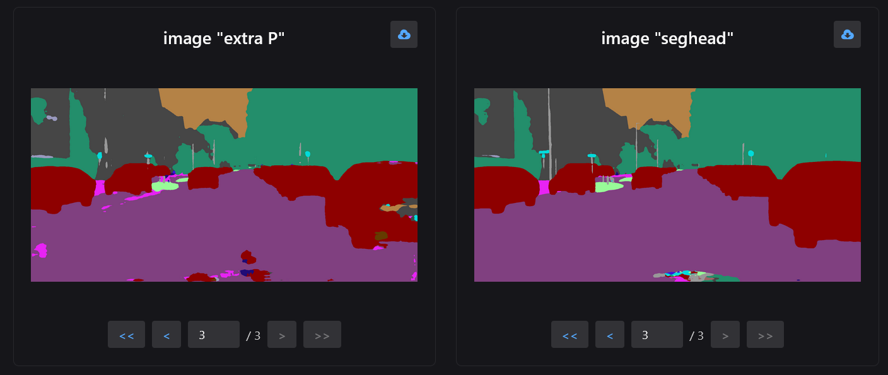

:::tip
`neetbox.add_image` allows you to send a tensor as image and see it in browser.
:::

## How it looks like




## Basic Usage

```python
import neetbox
import torch

a = torch.zeros((300, 300))
a[:150, :150] = 1
b = torch.zeros((300, 300))
b[150:, :150] = 2
c = torch.zeros((300, 300))
c[150:, 150:] = 3
t = torch.stack([a, b, c])
neetbox.add_image(name="as CWH", image=t, dataformats="CWH")
neetbox.add_image(name="as NWH", image=t, dataformats="NWH")
t = torch.stack([t, t, t])
neetbox.add_image(name="as NCWH", image=t, dataformats="NCWH")

while True:
    pass

```


:::tip

As you can see above, `dataformats` controls how neetbox understand the tensor as an image.

For example, `dataformats="NCWH"` means the first axis of the tensor is **N**umber of batches, the second axis is **C**hannel, and the third axis is **W**idth, and the fourth axis is **H**eight.

Pass a string consists of 'N', 'C', 'H', 'W' and neetbox will understand your tensor.

:::

## API description

`neetbox.add_image` send an image to frontend display.

```python
def add_image(name: str, image, dataformats: str = None)
```

Args:

- image (Union[np.array, Image.Image, Tensor]): image from cv2 and PIL.Image as well as tensors are supported
- name (str): name of the image, used in frontend display
- dataformats (str): if you are passing a tensor as image, please indicate how to understand the tensor. For example, dataformats="NCWH" means the first axis of the tensor is Number of batches, the second axis is Channel, and the third axis is Width, and the fourth axis is Height.
