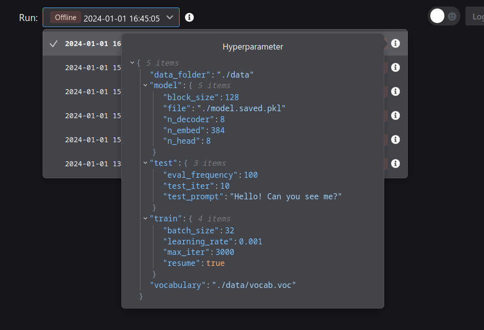

:::tip
`neetbox.add_image` allows you to send a image and see it in browser.
:::

## How it looks like


## Basic Usage

```python
import neetbox
import time

configs = {
    "data_folder": "./data",
    "vocabulary": "./data/vocab.voc",
    "model": {
        "block_size": 128,
        "file": "./model.saved.pkl",
        "n_decoder": 8,
        "n_embed": 384,
        "n_head": 8,
    },
    "test": {"eval_frequency": 100, "test_iter": 10, "test_prompt": "Hello! Can you see me?"},
    "train": {"batch_size": 32, "learning_rate": 0.001, "max_iter": 3000, "resume": True},
}

neetbox.add_hyperparams(configs)
time.sleep(1)
```



## API description

`neetbox.add_hyperparams` add/set hyperparams to current run, the added hyperparams will show in frontend.

```python
def add_hyperparams(hparam: dict, name: str = None)
```

Args:

- hparam (dict): hyperparams
- name (str, optional): name of hyperparams. Defaults to None.
