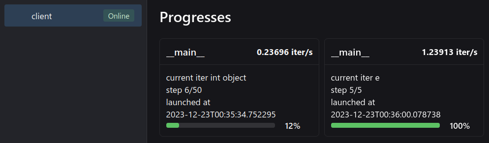

:::tip
`neetbox.progress` allows you to show progresses in neetbox frontend web page.
:::

## How it looks like


## Basic Usage

```python
import neetbox
from neetbox import logger
from tqdm import tqdm
import time

def a():
    logger.log("running a")
def b():
    logger.log("running b")
def c():
    logger.log("running c")
def d():
    logger.log("running d")
def e():
    logger.log("running e")

with tqdm(neetbox.progress(50)) as progress:
    for _ in progress:
        for func in neetbox.progress([a, b, c, d, e]):
            func()
            time.sleep(1)

```

On frontend web page:



In console:


:::tip

Since `neetbox.progress` decorates an iterable object and returns an iterator, you can use it as a normal iterator. For example. the following usages are legal:

```python
for i in neetbox.progress(100):
    ...
for func in neetbox.progress([fun1,fun2,fun3...]):
    ...
with tqdm(neetbox.progress(how_long)) as progress:
    ...
with neetbox.progress(tqdm(how_long)) as progress:
    ...
```

There are no additional restrictions on using `neetbox.progress`.

:::

## API description

`neetbox.progress` decorates an iterable object, returning an iterator. Neetbox will send progress to frontend while you are iterating through it.

```python
class Progress:
    def __init__(self, input: Union[int, enumerate, any])
```

Args:

- input (Union[int, enumerate, any]): Something to iterate or something to create enumeratable object.
