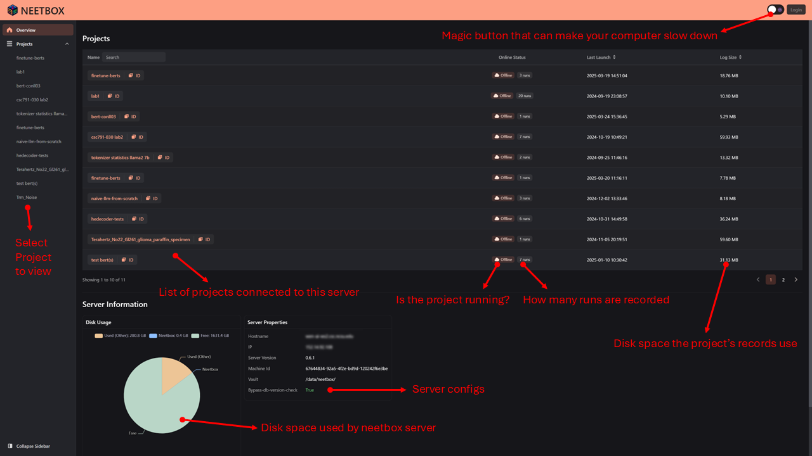
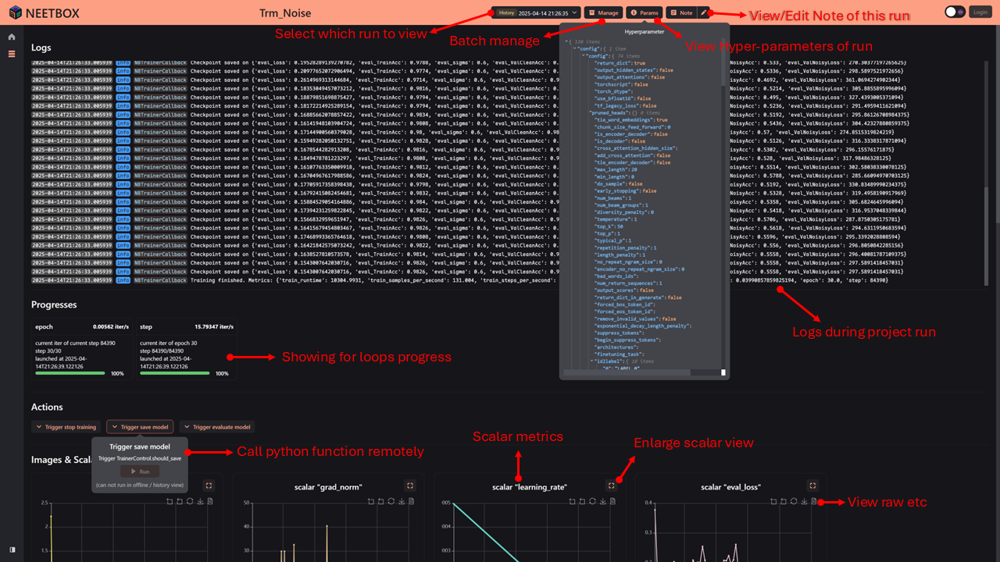
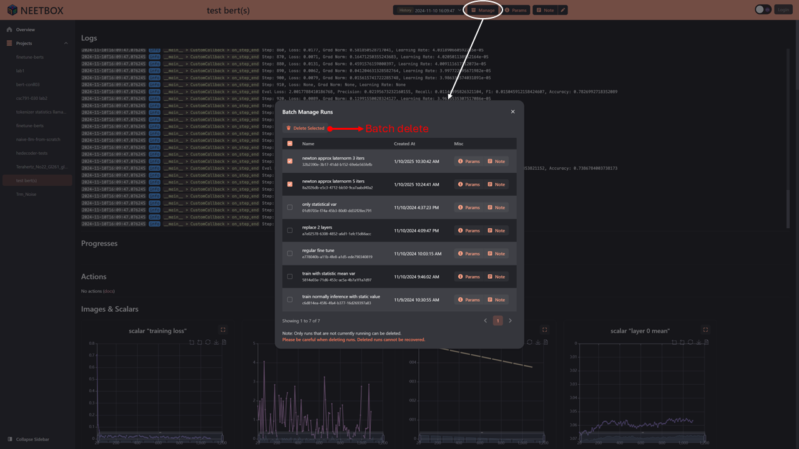
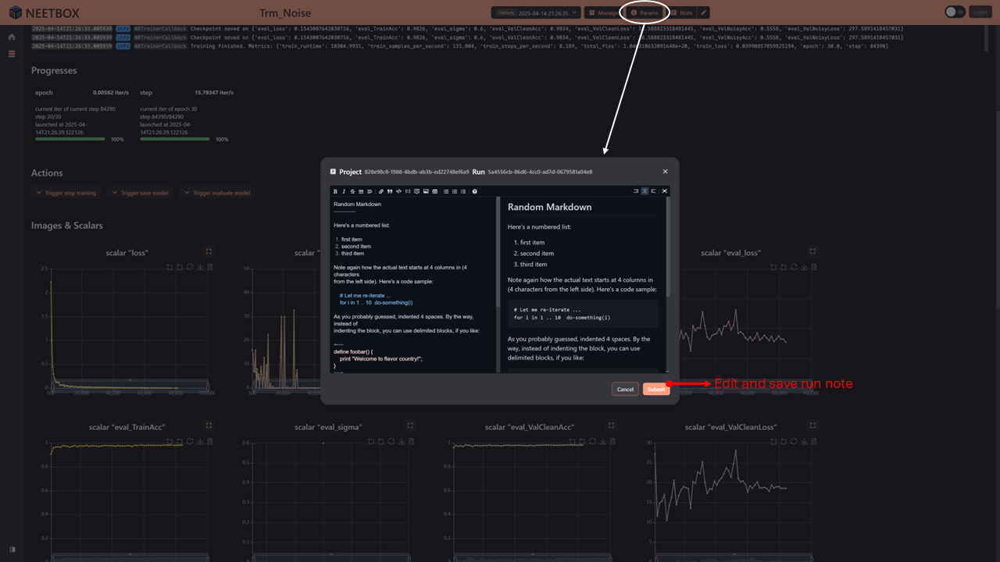
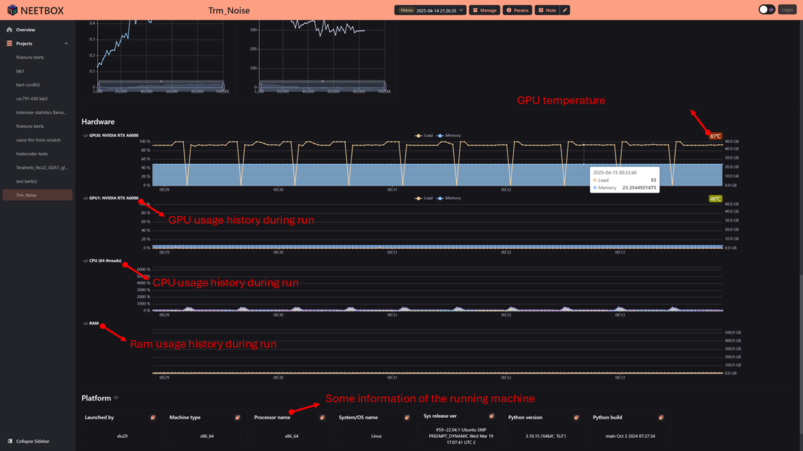

After launching your project, the neetbox frontend will be available at `http://localhost:20202` by default. If you have your [seperately hosted neetbox server](../server-hosting/), you can access the frontend by navigating to `http://<your-server-ip>:<your-server-port>`.

---

---

---

---

---

