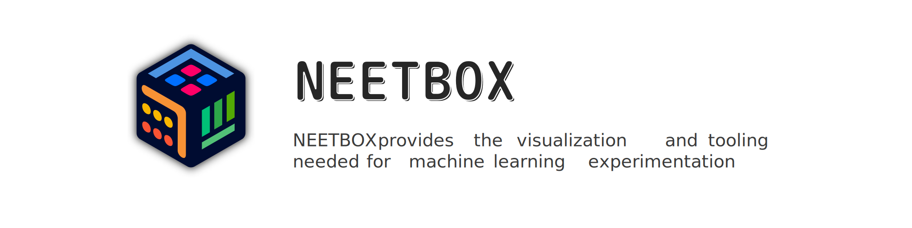
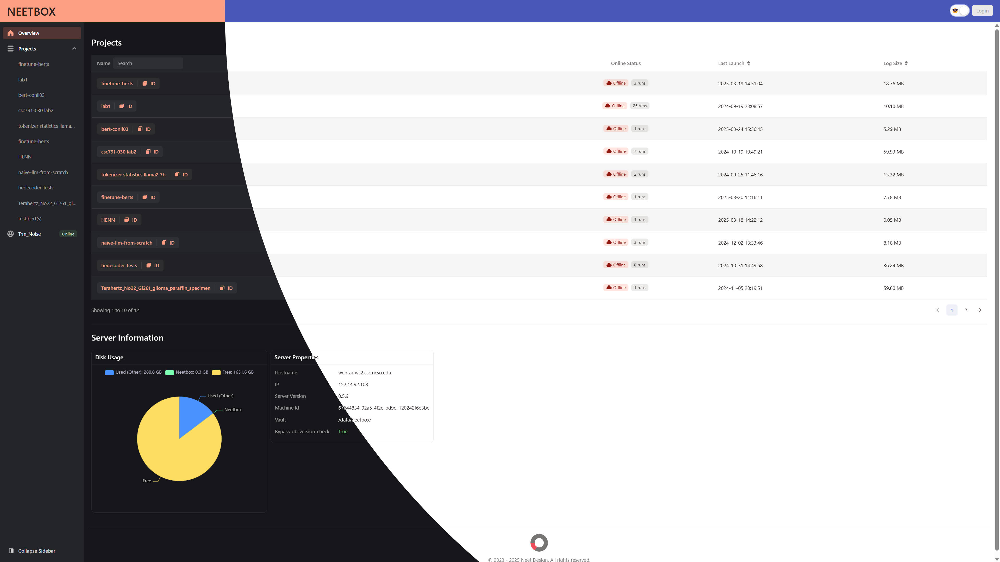
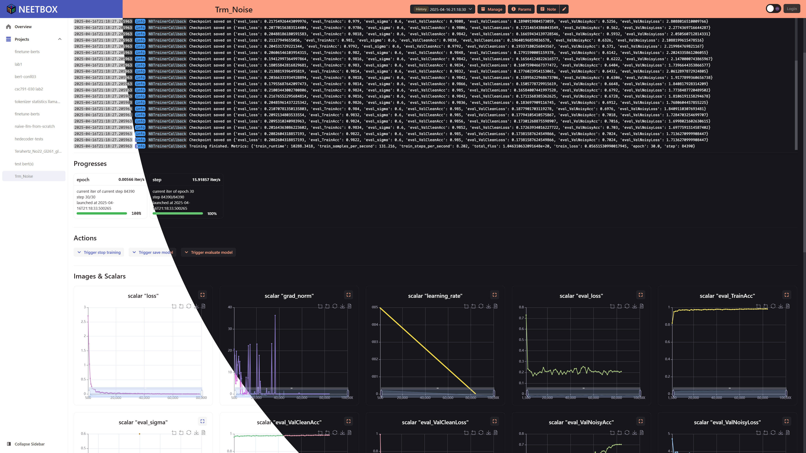

> The name NEETBOX is derived from the word "NEET"(see [wikipedia](https://en.wikipedia.org/wiki/NEET)). It was named this way because NEETBOX is a naive project, and the people who developed NEETBOX are idiots.

NEETBOX is an easy-to-use dashboard for visualizing training processes of machine learning models. It is designed to be simple and easy to use, with a focus on providing a clean and intuitive interface for users. NEETBOX has:

- [x] Easy python APIs
- [x] Everywhere connectivity
- [x] Easy server hosting

|Homepage|Dashboard|
|:--:|:--:|
|||


---

## How to install
  

```bash
pip install neetbox
```

---

## How to use

### Quick Example

- Please refer to [the example](./example.mdx) for a quick start
- Then take a look at [Python APIs](./python-apis) for usage of neetbox
- See also [frontend manual](./frontend-manual) for more details about the frontend.

### Working with multiple machines

- Basic configuration concepts please read [configureations](./configurations).
- Server hosting please read [how to host a neetbox server](./server-hosting).

---

## Acknowledgments

Maintainers:
|                                     VisualDust                                     |                                  Lideming                                  |
| :--------------------------------------------------------------------------------: | :------------------------------------------------------------------------: |
|              |        |
|                                  Except frontend                                   |                                  Frontend                                  |
| links: [github](https://github.com/visualDust) and [blog](https://gavin.gong.host) | links: [github](https://github.com/lideming) and [blog](https://yuuza.net) |

All contributors:

<a href = "https://github.com/visualDust/neetbox/graphs/contributors">
  
</a>

This project usues [PyDocuSaurus](https://github.com/Asthestarsfalll/PyDocuSaurus) to generate the [API reference](/docs/apidocs/)

---

## Donate

Donate us by giving a star for our repo [neetbox](https://github.com/visualDust/neetbox)
