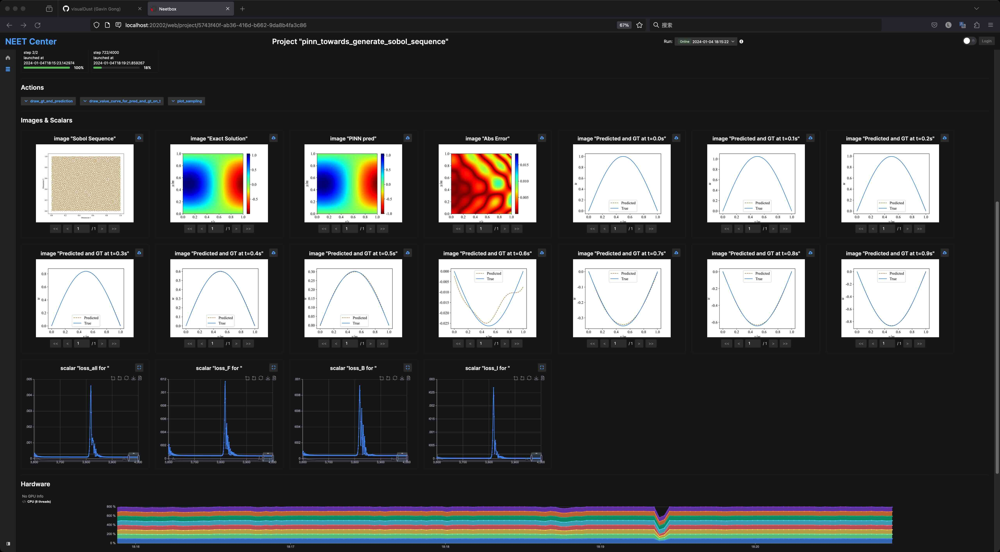

## Introduction

> <span style={{fontSize:"30px", color:"red"}}><strong><i>I hate tensorboard, let’s make a toolbox to replace it</i></strong></span>
> —— Someone who created a new folder named NEETBOX

Therefore, NEETBOX is a ~~tensorboard replacement~~ python package which provides **dashboard for monitoring and managing deep learning projects**.

> But wait, Tensorboard is actually a great software, DO NOT necessarily hate it, I'm just joking.

Therefore, The name NEETBOX is derived from the word "NEET"(see [wikipedia](https://en.wikipedia.org/wiki/NEET)). It was named this way because NEETBOX is a naive project, and the people who developed NEETBOX are idiots.

Screenshot of NEETBOX:


## Advantages

- [x] Forget configuration
- [x] Super easy python APIs
- [x] Monitoring multiple project in a single dashboard
- [x] Better project level management
- [ ] NEETBOX is under heavy development, more features are coming.

---

## How to install

NEETBOX consists of:
- [x] python apis
- [x] daemon server
- [x] frontend web pages

and they are already in NEETBOX python package. You can install neetbox by a single `pip install`:

```bash
pip install neetbox
```
supported platforms:

  

---

## How to use

### Quick start

Please refer to [the example](/docs/howto/example.mdx) for a quick start, and take a look at Python APIs in the side bar.

### After quick start

- If you're using neetbox on a single computer, congratulations, you have mastered basic neetbox apis.
- Or, if you want to manage projects running on multiple machines, read [how to host a neetbox server](/docs/howto/ServerHosting) and [manage history files](/docs/howto/ServerHosting/manage-history-files.mdx). Optionally, take a look at [understand how neetbox connects](/docs/howto/ServerHosting/understand-connections.mdx).

---

## Acknowledgments

Maintainers:
|                                     VisualDust                                     |                                   Lideming                                    |
| :--------------------------------------------------------------------------------: | :---------------------------------------------------------------------------: |
|              |           |
|                                  Except frontend                                   |                                   Frontend                                    |
| links: [github](https://github.com/visualDust) and [blog](https://gavin.gong.host) | links: [github](https://github.com/lideming) and [blog](https://yuuza.net) |

All contributors:

<a href = "https://github.com/visualDust/neetbox/graphs/contributors">
  
</a>

---

## Donate

Donate us by giving a star for our repo [neetbox](https://github.com/visualDust/neetbox)
