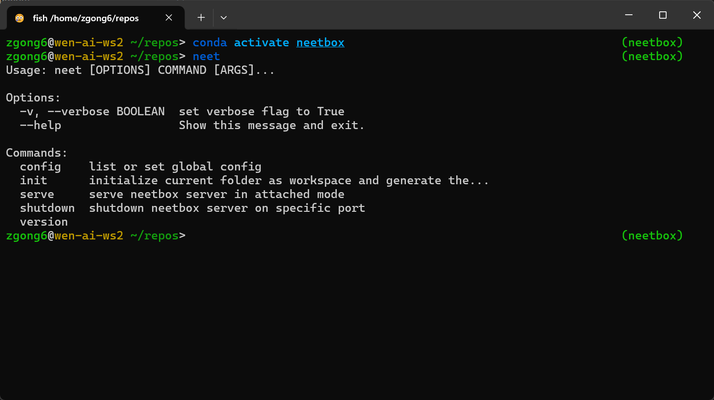

After installing neetbox, `neet` command will be available in your environment. NEET CLI is a command line interface that helps with initializing and configuring projects that integrate neetbox, or [hosting neetbox server](../server-hosting/).

```bash
neet --help
```



---

## Initialize a new project

While this can be automatically done when you `import neetbox` and use neetbox in your project, you can also manually initialize a project to integrate neetbox via `neet init` command. This will create a `neetbox.json` configuration file in the current directory. 

```bash
neet init
```


When you run python code with `neetbox` imported, the CLI will automatically check if the `neetbox.json` file exists in the wproject directory and read configuration from it. If the file does not exist, it will create a new one with default settings.

---

Other commands are related to hosting neetbox server and will be described in the [server hosting docs](../server-hosting/).