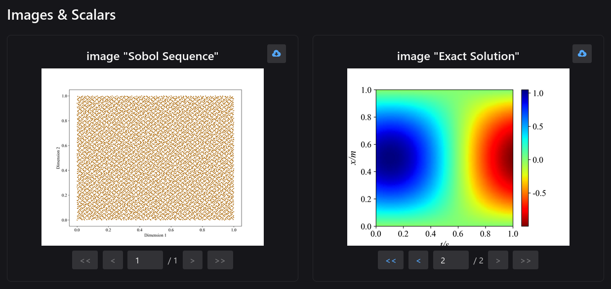
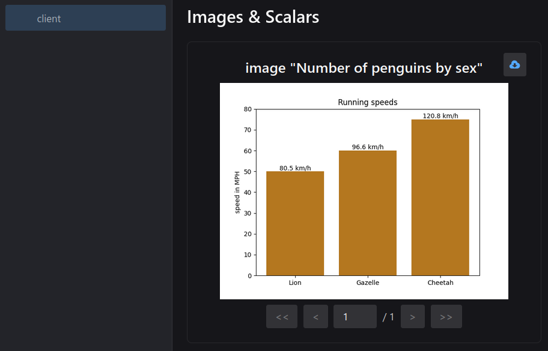

:::tip
`neetbox.add_figure` allows you to send a pyplt figure as image and see it in browser.
:::

## How it looks like




## Basic Usage

```python
import matplotlib.pyplot as plt
import neetbox

animal_names = ['Lion', 'Gazelle', 'Cheetah']
mph_speed = [50, 60, 75]

fig, ax = plt.subplots()
bar_container = ax.bar(animal_names, mph_speed)
ax.set(ylabel='speed in MPH', title='Running speeds', ylim=(0, 80))
ax.bar_label(bar_container, fmt=lambda x: f'{x * 1.61:.1f} km/h')

neetbox.add_figure(name="Number of penguins by sex", figure=plt.gcf())
```




## API description

`neetbox.add_figure` render matplotlib figure into an image and add it to summary. Note that this requires the ``matplotlib`` package.

```python
def add_figure(name: str, figure, close: Optional[bool] = True):
```

Args:

- tag: Data identifier

- figure (matplotlib.pyplot.figure) or list of figures: Figure or a list of figures
- global_step: Global step value to record
- close: Flag to automatically close the figure
- walltime: Override default walltime (time.time()) of event
