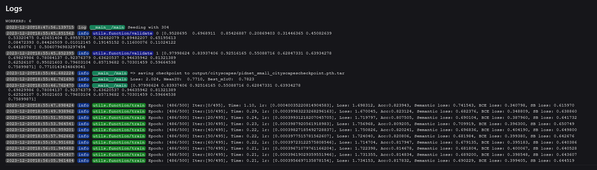
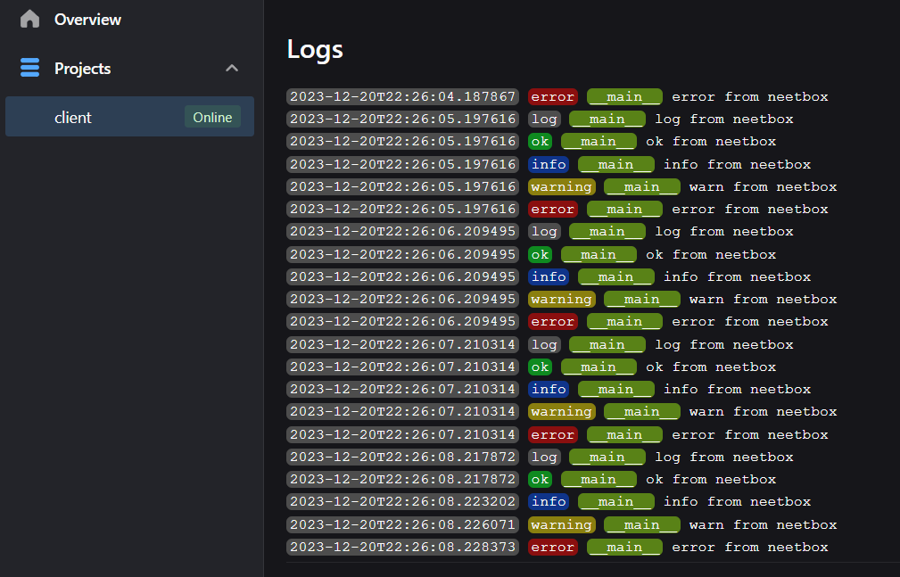
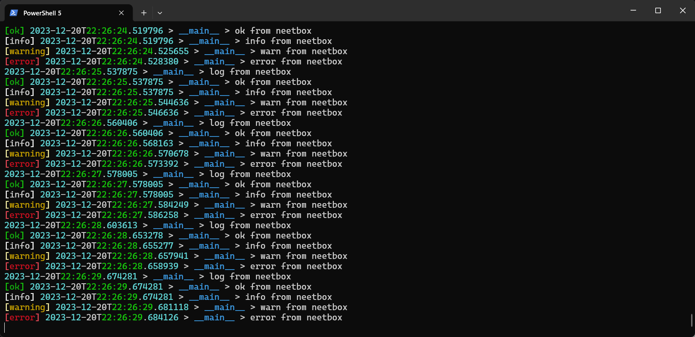

:::tip
`neetbox.logger` allows you to write logs into frontend, console, and log files.
:::

## How it looks like



## Basic Usage

```python
from neetbox import logger
import time

while True:
    time.sleep(1)
    logger.log("log from neetbox")
    logger.ok("ok from neetbox")
    logger.info("info from neetbox")
    logger.debug("debug from neetbox")
    logger.warn("warn from neetbox")
    logger.err("error from neetbox")
```

On frontend web page:



In console:



## API Reference

`neetbox.logger` write logs to frontend display, console, and log files.

```python
def log(
    self,
    *content,
    prefix: Optional[str] = None,
    datetime_format: Optional[str] = None,
    with_identifier: Optional[bool] = None,
    with_datetime: Optional[bool] = None,
    skip_writers: list[str] = [],
    traceback=2,
)
```

Args:
- prefix (Optional[str], optional): prefix shows at the start of console log while it shows as a tag on frontend. Defaults to None.
- datetime_format (Optional[str], optional): change the format neetbox displays time. Defaults to None, neetbox will use default style ("%Y-%m-%dT%H:%M:%S.%f") if None is passed.
- with_identifier (Optional[bool], optional): whether to show who is logging, note that this option has noting todo with traceback. Defaults to None(True).
- with_datetime (Optional[bool], optional): whether to show datetime in logs. Defaults to None(True).
- skip_writers (list[str], optional): writers to skip, possible writes are 'stdout'(write into console), 'file'(write into file), 'ws'(write to frontend). Defaults to [], which means write to all writers.
- traceback (int, optional): level of traceback. Defaults to 2. Do not change this option unless you know what you are doing.
