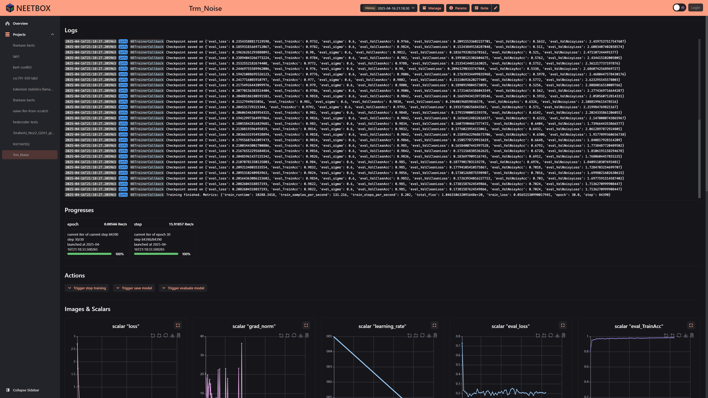
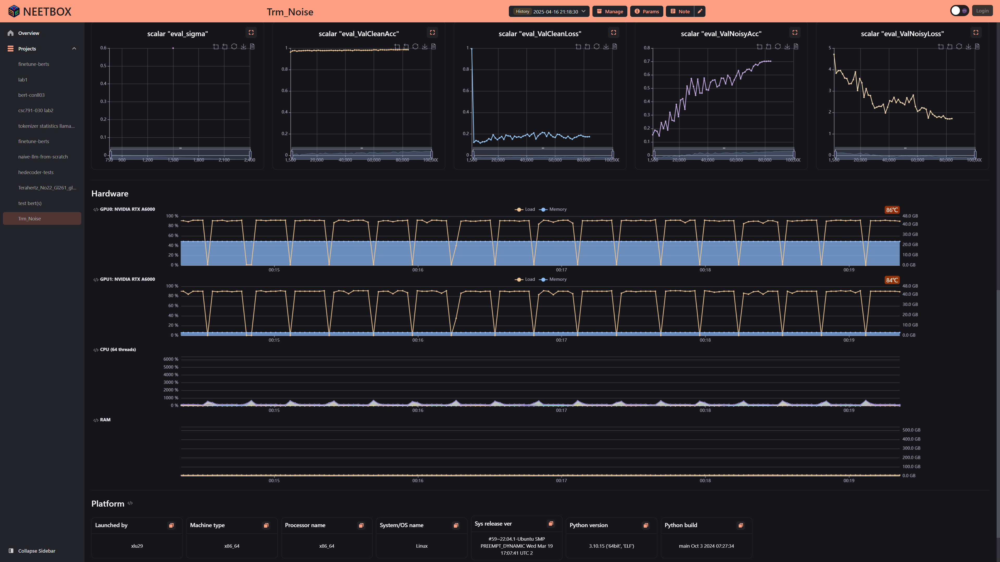

:::tip
There is a trainer callback extention for `transformers.Trainer`
:::

## Basic Usage

Import and use as trainer callback:

```python
from neetbox.extension.transformers.callback import NeetboxTrainerCallback

...
trainer = Trainer(
    model=model,
    args=training_args,
    ......,
    callbacks=[NeetboxTrainerCallback()], # <-- Here
)
```


## Full Example

Code above will finetune BERT on [conll03](https://huggingface.co/datasets/eriktks/conll2003), the dashboard looks like:







```python
import torch
from datasets import load_dataset
from transformers import (
    AutoTokenizer,
    BertForTokenClassification,
    Trainer,
    TrainingArguments,
    DataCollatorForTokenClassification,
)
import evaluate
from neetbox import logger
from neetbox.extension.transformers.callback import NeetboxTrainerCallback

# Load the dataset
dataset = load_dataset("conll2003")
# Load the tokenizer and model
tokenizer = AutoTokenizer.from_pretrained(
    "dbmdz/bert-large-cased-finetuned-conll03-english"
)
model = BertForTokenClassification.from_pretrained(
    "dbmdz/bert-large-cased-finetuned-conll03-english"
)

logger.info(f"Model loaded: {model}")


# ================ Finetune ================

# Define label mapping
label_list = dataset["train"].features["ner_tags"].feature.names
num_labels = len(label_list)


# Preprocess function
def preprocess_function(examples):
    tokenized_inputs = tokenizer(
        examples["tokens"],
        is_split_into_words=True,
        padding="max_length",
        truncation=True,
    )
    labels = []
    for i, label in enumerate(examples["ner_tags"]):
        word_ids = tokenized_inputs.word_ids(batch_index=i)
        label_ids = []
        previous_word_id = None
        for word_id in word_ids:
            if word_id is None:
                label_ids.append(-100)  # Ignored during training
            elif word_id != previous_word_id:
                label_ids.append(label[word_id])
            else:
                label_ids.append(-100)
            previous_word_id = word_id
        labels.append(label_ids)
    tokenized_inputs["labels"] = labels
    return tokenized_inputs


# Apply preprocessing
tokenized_datasets = dataset.map(preprocess_function, batched=True)

# Remove unnecessary columns and set format
tokenized_datasets = tokenized_datasets.remove_columns(
    ["tokens", "pos_tags", "chunk_tags"]
)
tokenized_datasets.set_format("torch")

# Data collator for token classification
data_collator = DataCollatorForTokenClassification(tokenizer)

# Metric function using `evaluate`
seqeval = evaluate.load("seqeval")


def compute_metrics(pred):
    predictions, labels = pred
    predictions = torch.argmax(torch.tensor(predictions), dim=2)

    # Remove ignored index (-100) and convert to labels
    true_predictions = [
        [label_list[p] for (p, l) in zip(prediction, label) if l != -100]
        for prediction, label in zip(predictions, labels)
    ]
    true_labels = [
        [label_list[l] for (p, l) in zip(prediction, label) if l != -100]
        for prediction, label in zip(predictions, labels)
    ]

    results = seqeval.compute(
        predictions=true_predictions, references=true_labels
    )

    return {
        "precision": results["overall_precision"],
        "recall": results["overall_recall"],
        "f1": results["overall_f1"],
        "accuracy": results["overall_accuracy"],
    }


# Training arguments
training_args = TrainingArguments(
    output_dir="./results",
    eval_strategy="steps",  # Evaluate at regular steps
    eval_steps=100,  # Perform evaluation every 100 steps
    save_strategy="steps",  # Save the model at the end of each epoch
    learning_rate=1e-5,
    per_device_train_batch_size=16,
    per_device_eval_batch_size=16,
    num_train_epochs=400,
    weight_decay=0.01,
    logging_dir="./logs",
    logging_strategy="steps",
    logging_steps=10,
    save_total_limit=5,
    load_best_model_at_end=True,
    metric_for_best_model="f1",
    greater_is_better=True,
    report_to="none",
)


# Trainer
trainer = Trainer(
    model=model,
    args=training_args,
    train_dataset=tokenized_datasets["train"],
    eval_dataset=tokenized_datasets["validation"],
    tokenizer=tokenizer,
    data_collator=data_collator,
    compute_metrics=compute_metrics,
    callbacks=[NeetboxTrainerCallback()],
)

# Fine-tune the model
trainer.train(resume_from_checkpoint=True)

# Evaluate the model
results = trainer.evaluate()
print(results)

# Save the fine-tuned model
trainer.save_model("./fine_tuned_ner_model-replaced-var-layernorm")
```
