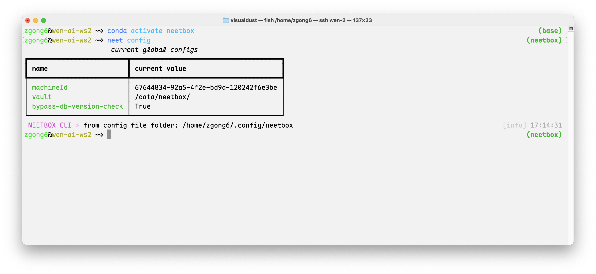
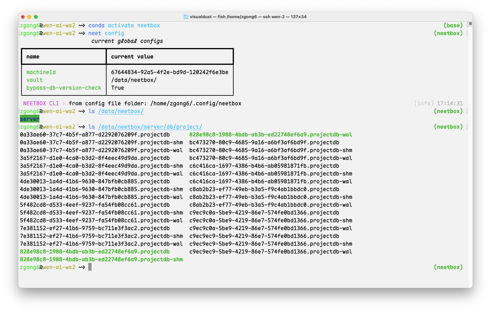
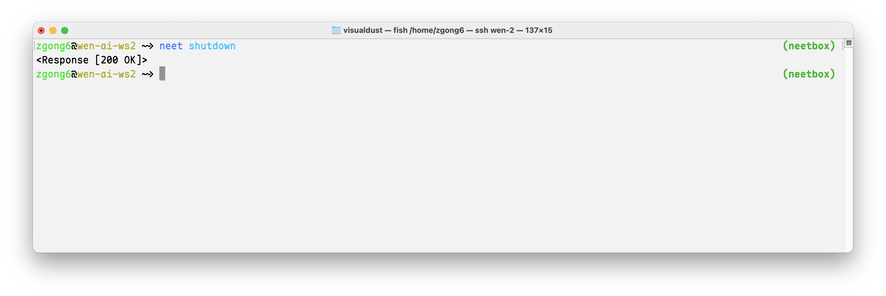
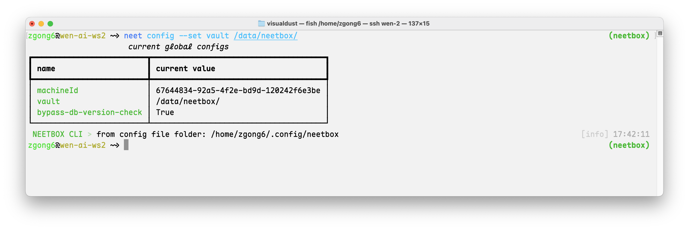

:::tip What is history data?
History data is the data that neetbox server stores for you. It is used to visualize the training process of your machine learning models. You can view the history data in the neetbox frontend. If you want to move the history data, you can do so by copying the history files to new location and configuring the neetbox server to use the new location. You can also backup/delete the history data if you want.
:::

## Where is the history data stored?

You can check the location of the history data with neetbox cli:

```bash
neet config
```



The config value of key `valut` is the location of the history data. By default it is set to app data directory.

If you check the content of that directory:

```bash
ls <the-neetbox-valut-dir>/server/db/project/
```



Those history data are stored as sqlite database files. The name of the file is `<project-id>.projectdb`, where `<project-id>` is the id of the project. You can find the project id in the neetbox frontend.

## Moving history data to another location

Three steps are needed to move the history data to another location:
1. Stop the currently running neetbox server, if any.
2. Move the history data to the new location.
3. Configure the neetbox server to use the new location.

Stop the currently running neetbox server:

```bash
neet shutdown
```



Then, move the history data to the new location. For example, if you want to move the history data to `/data/neetbox`:

```bash
mv <current-neetbox-data-dir> /data/neetbox/
```

Then, you need to configure the neetbox server to use the new location. You can do this by running the following command:

```bash
neet config --set vault /data/neetbox/
```


You will see the vault directory is changed to the new location. Start the neetbox server again and it will use the new location to store the history data.