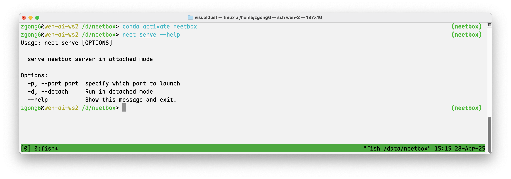
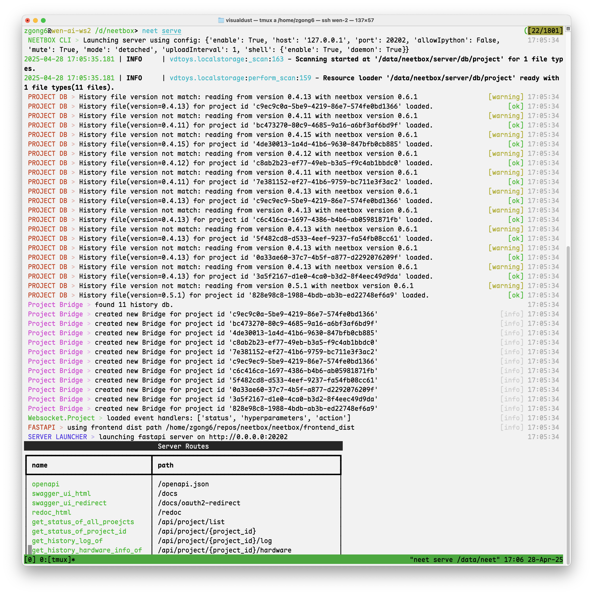

Neetbox server app can be launched solely via neetbox command line interface (CLI).

```bash
neet serve --help
```



## Run a neetbox server

```bash
neet serve
```

This command will start a neetbox server on the default port `20202`:



Assume this server's ip address is `<neetbox-server-ip>`, you can access the neetbox frontend server via `http://<neetbox-server-ip>:20202` in your browser.

## Use the neetbox server in your project

In each of your projects' config file, you can set the neetbox server address:

```toml
name = "your project name"
...
[client]
enable = true
host = "<neetbox-server-ip>"    # <- Modify this line
port = 20202                    # <- Modify this line
...
```

Then, when you run your project, it will connect to the neetbox server you just started.